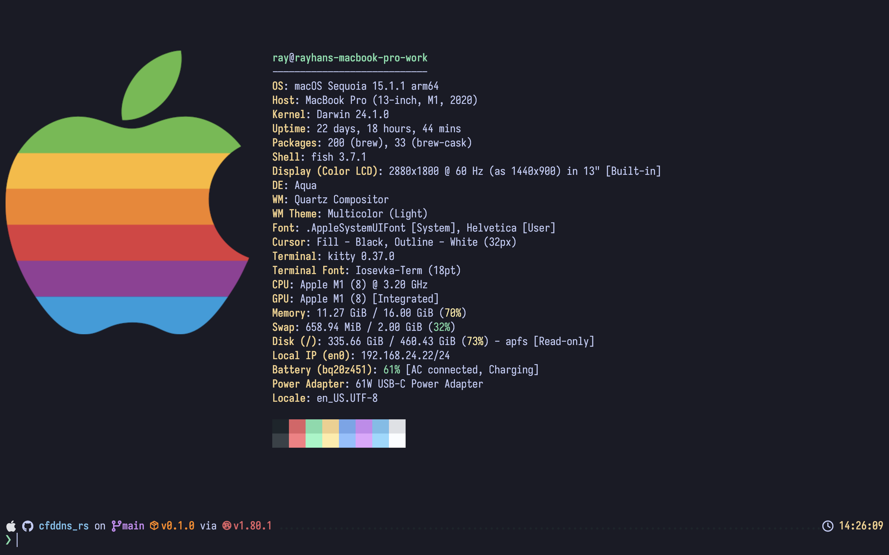
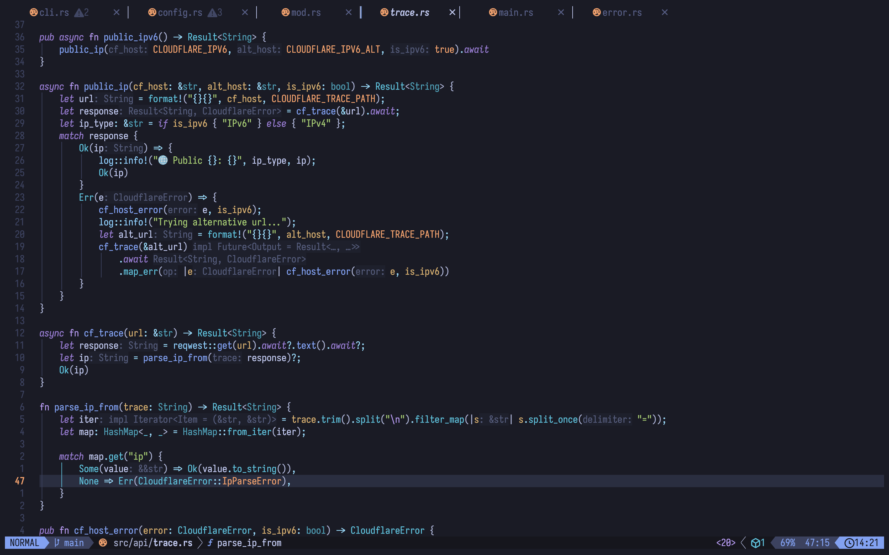

# Rayhan's dotfiles

<p align="middle">
  
  
</p>

These configurations can be loaded via GNU [`stow`](https://www.gnu.org/software/stow/) command.

E.g.

```sh
# Clone the repo
git clone https://github.com/rayhannabi/dotfiles
# Navigate to the cloned repo
cd dotfiles
# Run stow to generate symlinks
stow nvim
```

This creates a symlink in the `~/.config/nvim/` directory.

## Programs

- **Kitty** - [Website](https://sw.kovidgoyal.net/kitty/) | [Arch](https://archlinux.org/packages/extra/x86_64/kitty/)
- **NeoVim** - [Website](https://neovim.io/), Distro: [LazyVim](https://github.com/LazyVim/LazyVim) | [Arch](https://archlinux.org/packages/extra/x86_64/neovim/)
- **Starship** - [Website](https://starship.rs) | [Arch](https://archlinux.org/packages/extra/x86_64/starship/)

## Themes

- [TokyoNight](https://github.com/folke/tokyonight.nvim) with _Night_ variant

## Fonts

- Iosevka Term - [Website](https://typeof.net/Iosevka/) | [AUR](https://aur.archlinux.org/packages/ttf-iosevka-term)
- Symbols Nerd Fonts - [Website](https://github.com/ryanoasis/nerd-fonts) | [AUR](https://archlinux.org/packages/extra/any/ttf-nerd-fonts-symbols/)
