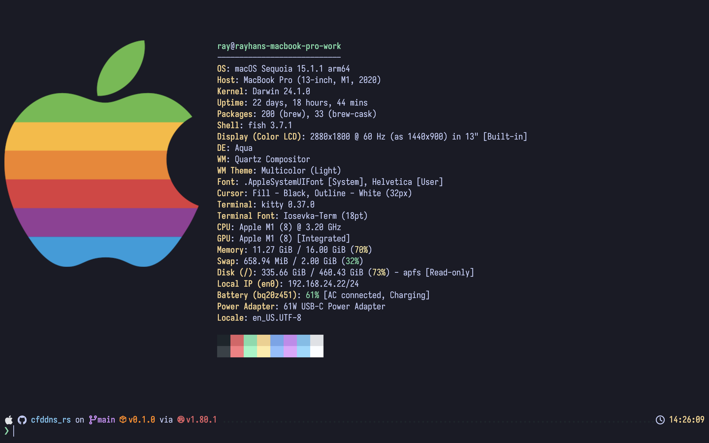
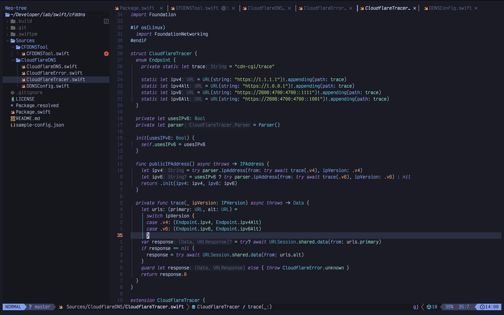

# Rayhan's Dotfiles

<p align="middle">
  
  
</p>

These configurations can be loaded via GNU [`stow`](https://www.gnu.org/software/stow/) command.

E.g.

```sh
# Clone the repo
git clone https://github.com/rayhannabi/dotfiles
# Navigate to the cloned repo
cd dotfiles
# Run stow to generate symlinks
stow nvim
```

This creates a symlink in the `~/.config/nvim/` directory.

## Programs

- [Kitty](https://sw.kovidgoyal.net/kitty/)
- [NeoVim](https://neovim.io/), Distro: [LazyVim](https://github.com/LazyVim/LazyVim)
- [Starship](https://starship.rs)
- [Ghostty](https://ghostty.org)
- [LazyGit](https://github.com/jesseduffield/lazygit)
- [ZSH](https://www.zsh.org/) / [FZF](https://github.com/junegunn/fzf) - [README.md](/zsh/.config/zsh/README.md)

## Themes

- [TokyoNight](https://github.com/folke/tokyonight.nvim) with _Night_ variant.
- Default GTK Theme modification with macOS style traffic light window buttons.

## Fonts

- Iosevka Nerd Font
