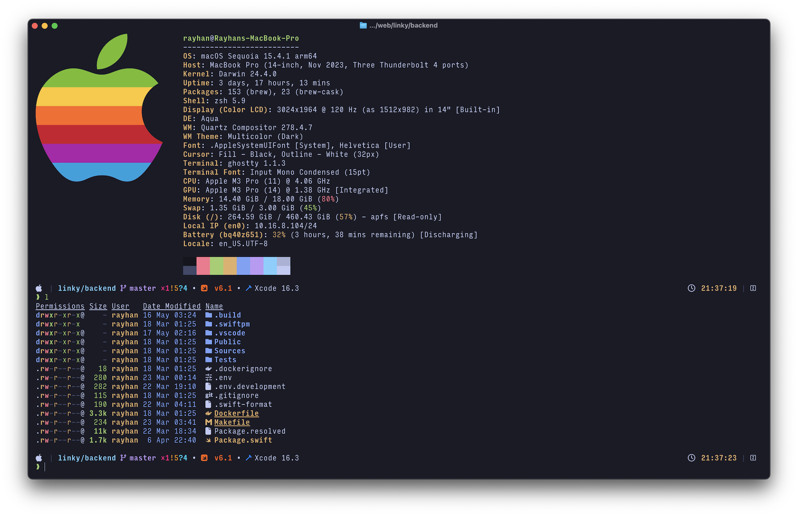
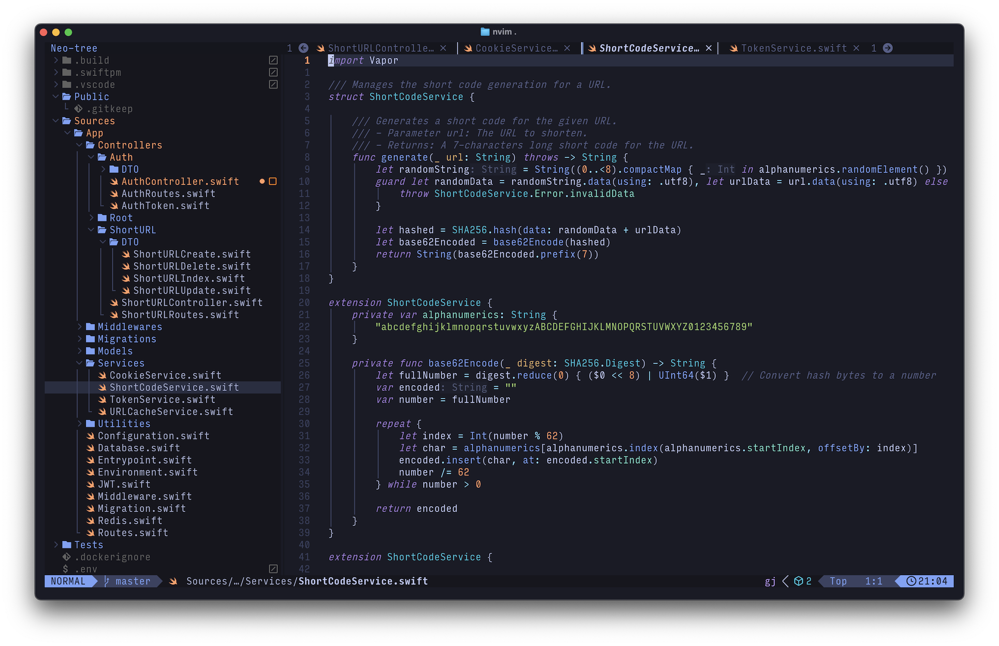
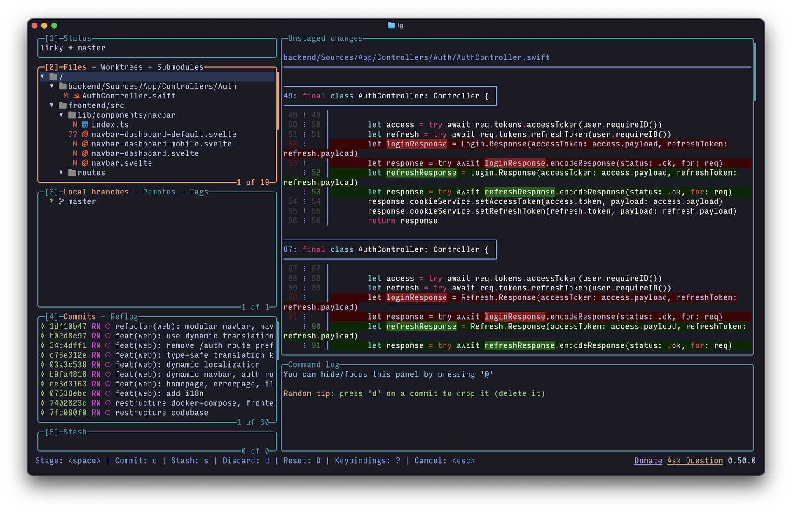

# Rayhan's Dotfiles

<div>
    
    <div style="display:flex;">
        
        
    </div>
</div>

## Usage

These configurations can be loaded via GNU [`stow`](https://www.gnu.org/software/stow/) command.

E.g.

```sh
# Clone the repo in your $HOME directory
git clone https://github.com/rayhannabi/dotfiles
# Navigate to the cloned repo
cd dotfiles
# Run stow to generate symlinks
stow nvim
```

This creates a symlink in the `~/.config/nvim/` directory.

## Programs

- [Ghostty](https://ghostty.org)
- [Kitty](https://sw.kovidgoyal.net/kitty/)
- [NeoVim](https://neovim.io/), Distro: [LazyVim](https://github.com/LazyVim/LazyVim)
- [Starship](https://starship.rs)
- [LazyGit](https://github.com/jesseduffield/lazygit)
- [FZF](https://github.com/junegunn/fzf)
- [Fish](https://github.com/fish-shell/fish-shell)
- [ZSH](https://www.zsh.org/) - [README.md](/zsh/.config/zsh/README.md)

## Themes

- [TokyoNight](https://github.com/folke/tokyonight.nvim) with _Night_ variant.

## Fonts

- [Iosevka](https://github.com/b5invis/Iosevka)
- [Nerd Fonts](https://github.com/ryanoasis/nerd-fonts)
